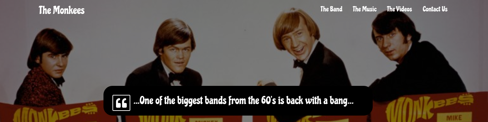

# Milestone Project One The Monkees

To create a Mobile First Responsive Website for a band called The Monkees  
https://jsnbly.github.io/milestoneone/  

## UX

The UX was designed for Fans, Potential Fans and Clients of the band the Monkees. The Following User stories were used 

- As an existing Fan I want to hear new and old Music Tracks  
The Music Section includes Audio to Play as well as links to Spotify for the back catalogue

- As a New Fan I would like to learn more about the Band  
The Band Section introduces the Band members and their Roles it also links to Facebook, Twitter and Instagram

- As a Potential Client I would like to see videos of the Band in Action  
The Video Section shows clips of the band in action and links the user to youtube

- I would like to Contact the Band to arrange a booking  
The Contact Section offers the user a way to contact the band directly and gives them options of types of queries

## Links to UX Documentation

Strategy  
https://jsnbly.github.io/milestoneone/User-exp-design/strategy/strategy-monkees.pdf

Scope  
https://jsnbly.github.io/milestoneone/User-exp-design/scope/scope-monkees.pdf

Structure
https://jsnbly.github.io/milestoneone/User-exp-design/structure/structure-monkees.pdf

Skeleton  
The UX was designed using the following Wireframes for Mobile and Desktop  
https://jsnbly.github.io/milestoneone/User-exp-design/skeleton/milestone1mobilewireframe.png      
https://jsnbly.github.io/milestoneone/User-exp-design/skeleton/DesktopWireframe.pdf

Surface  
https://jsnbly.github.io/milestoneone/  

## Features

1. Responsive Navbar/Hamburger Dropdown at top of the page to allow quick access to different sections.  
2. Jumbotron/News Section, Designed to contain the most relevent news on the site  
3. Band Section, has information about the band members as well as social media links for easy access to social media platforms  
4. Music Section, Has a list of the bands albums, Audio Players to give the user a sample of the Bands music also Links to Spotify  
5. Video Section, Has a list of the bands Videos, Video Player to give the user a sample of the Bands Videos also link to Youtube  
6. Contact Section, Has a web form the user can fill in to contact the band to arrange a performance.  
7. Footer has links to social media channels.  

### Features Left to Implement
- Online Store
- Tour Calander for the Band

## Technologies Used
1. HTML5 / CSS3  
Used to Build the index.html and style.css Files : https://www.w3schools.com/html/html_intro.asp  
2. Google Chrome  
Used for Testing Code and Viewing Design on Different Resolutions : https://www.google.com/chrome/  
3. Bootstrap 3  
Framework used to help simplify responsive design : https://getbootstrap.com/docs/3.3/   
4. Google Fonts  
Used to aquire relevent font for project : https://fonts.google.com/  
5. Font Awesome  
Used to style Social Media Buttons : https://fontawesome.com/     
6. VSCode  
IDE used to develop project code : https://code.visualstudio.com/   
7. Git 2.11.0  
Used for Version Control : https://git-scm.com/  
8. Github  
Used for projects remote repository for Version Control : https://github.com/  
9. Terminal (ChromeOS)  
Used to run Git : https://support.google.com/chromebook/answer/9145439?hl=en     
10. Google Docs  
User Experience Documentation : https://www.google.com/docs/about/  
11. Gimp  
Wireframeing : https://www.gimp.org  
12. Mockflow   
Wireframeing : https://mockflow.com/app/#Wireframe  
13. Fav Icon Generated at : https://favicon.io/favicon-generator/  

## Testing

I used Developer Tools Device Tool Bar built into Google Chrome with Frames Enabled  
to allow me to view the website across a range of device resolutions and orientations  

Tested my HTML with https://validator.w3.org
Tested my CSS with https://jigsaw.w3.org/css-validator

1. Play Music:  
    Click to Music Section  
    Verify Track one plays, Test Controls Play/Pause Volume  
    Verify Track two plays, Test Controls Play/Pause Volume

2. Play Video:  
    Click to Video Section  
    Verify Video Plays  
    Test Controls Play,Pause,Volume and Full Screen

3. Contact Form:  
    Click to Contact Us Section  
    Try to Sumbit with blank information and verify error message  
    Check email address invalid error when incorrect email entered  
    Check for success message when form submitted successfully 

4. Jumbotron Responsive Background Displayed based on Resolution:  
    Test in Developer Tools at Resolution Greater than 768px making sure correct background is displayed   
    Test in Developer Tools at Resolition Smaller than 768px making sure correct background is displayed

## Deployment

The site was coded on VSCode and a local git repository was used for version control, This was pushed to github  
as new changes were added.

The site is hosted on github using GitHub Pages this has been enabled in the repository settings and linked to the Master Branch

Each Commit is pushed to github from a Debian Terminal on ChromeOS running git 2.11.0

There are no differences between the code deployed to github and development versions. 

Chrome was used to view the files locally.

## Credits
All images and videos used for educational purposes and remain copyright of orginal author!

### Content
Original content

### Media
listen.jpg https://en.wikipedia.org/wiki/Listen_to_the_Band_(album)  
monkees_portrait.jpg https://www.hollywoodreporter.com/thr-esq/musician-sues-monkees-discrimination-wrongful-880054  
mksbw.jpg https://en.wikipedia.org/wiki/The_Monkees  
All Other media taken from supplied Github Repo.  

### Acknowledgements
Code Institute Full Stack Course

